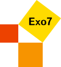

MathShorts : short videos of Mathematics
========================================

Sites
-----

* [Youtube](https://www.youtube.com/@Math-Shorts-Exo7)
* [GitHub](https://github.com/exo7math/math-shorts-exo7)

Videos
------

* [sh001] [Fractal IFS - Barnsley fern](https://youtube.com/shorts/KwhYeLM73Oo)
* [sh002] [Cardioid](https://youtube.com/shorts/e3m7qhR9q-E)
* [sh003] [Ulam Spiral](https://youtube.com/shorts/vqqgS9P_1Vo)
* [sh004] [Lagrange polynomials](https://youtube.com/shorts/Wwyr32K9giE)
* [sh005] [Truchet tilings](https://youtube.com/shorts/GwtAZu5WjD0)

